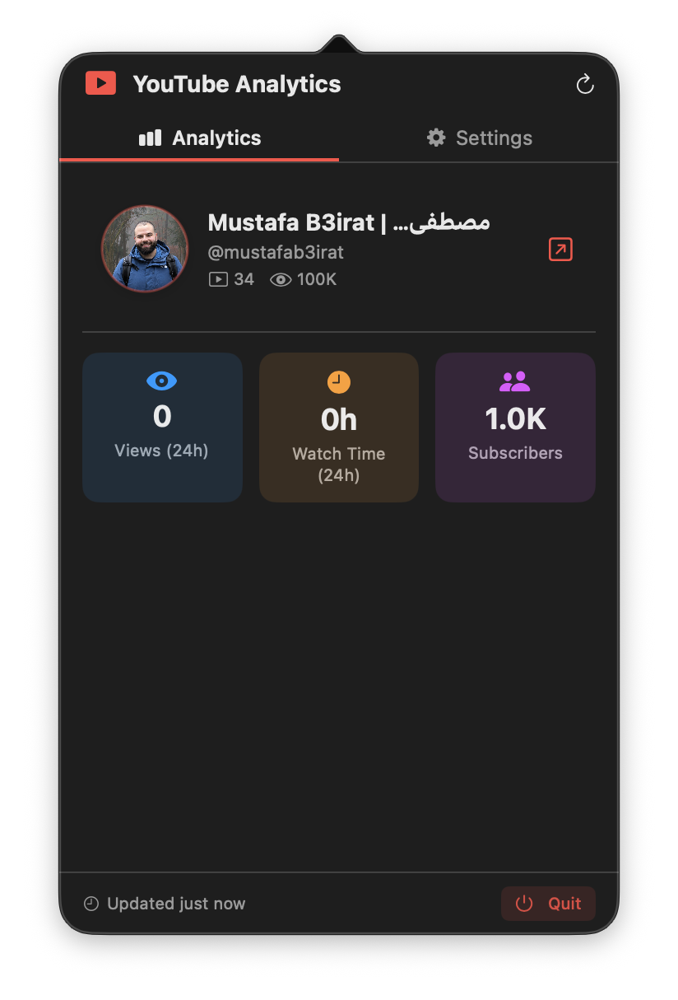
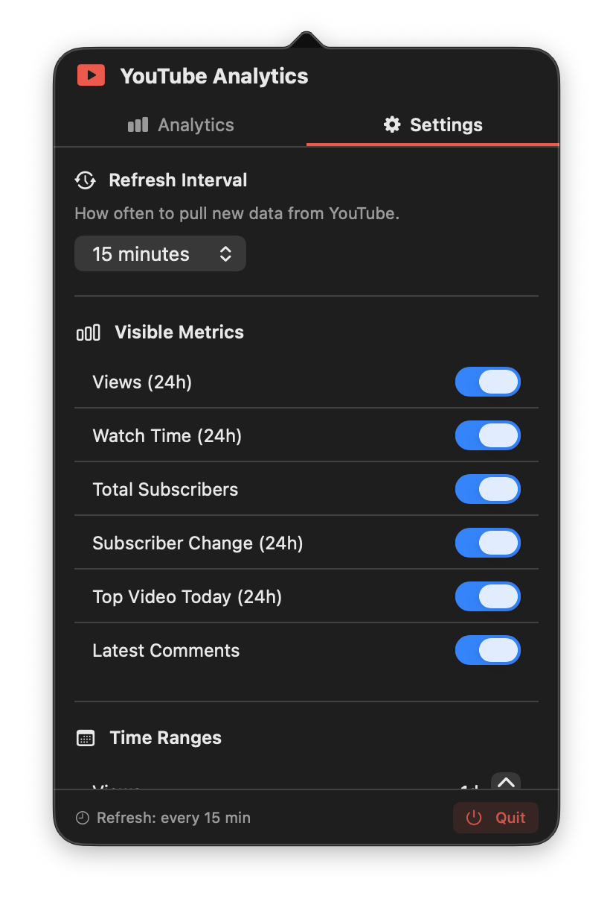

<div align="center">

# ytAnalytics

**Your YouTube channel stats — natively on your Mac.**

[](https://apple.com/macos)
[](https://python.org)
[](https://swift.org)

</div>

---

A lightweight local server authenticates with Google via OAuth and serves your YouTube analytics as JSON. Two native macOS interfaces display it — no browser, no dashboard, no manual refreshing.

- **Menu bar app** — live view count in your status bar; click for the full popover with all metrics and settings
- **Notification Centre widget** — Small, Medium, and Large sizes with your channel card and stats

<div align="center">

&nbsp;&nbsp;&nbsp;

</div>

---

## Requirements

- macOS 14 Sonoma or later
- Python 3.10+
- Xcode 15+
- A Google account with an active YouTube channel

---

## Setup

### 1. Clone

```bash
git clone https://github.com/MustafaB3irat/ytAnalytics-widget.git
cd ytAnalytics-widget
```

---

### 2. Google Cloud & OAuth (one-time, ~10 minutes)

#### 2a. Create a project

1. Go to [console.cloud.google.com](https://console.cloud.google.com)
2. Click the project dropdown (top-left) → **New Project**
3. Name it `ytAnalytics` → **Create**
4. Make sure the new project is selected before continuing

#### 2b. Enable the APIs

1. Go to **APIs & Services → Library**
2. Search **YouTube Data API v3** → **Enable**
3. Search **YouTube Analytics API** → **Enable**

#### 2c. Configure the OAuth consent screen

1. Go to **APIs & Services → OAuth consent screen**
2. User type: **External** → **Create**
3. Fill in the required fields:
   - App name: `ytAnalytics`
   - User support email: your Gmail
   - Developer contact email: your Gmail
4. Click **Save and Continue** through to **Scopes**
5. Click **Add or Remove Scopes** and add both:
   - `https://www.googleapis.com/auth/youtube.readonly`
   - `https://www.googleapis.com/auth/yt-analytics.readonly`
6. Click **Save and Continue** to **Test users**
7. Click **Add Users** → add your YouTube account email
8. Click **Save and Continue** → **Back to Dashboard**

> **Why "External" and "Test users"?** Google requires apps in development to be external. Only the email addresses you list as test users can sign in. Your data stays entirely local.

#### 2d. Create the OAuth credential

1. Go to **APIs & Services → Credentials**
2. Click **Create Credentials → OAuth 2.0 Client ID**
3. Application type: **Desktop app** → Name it anything → **Create**
4. Click **Download JSON** on the newly created credential
5. Rename the file to `client_secret.json`
6. Place it at:
   ```
   server/credentials/client_secret.json
   ```

The `credentials/` folder is git-ignored — this file never leaves your machine.

---

### 3. Run setup.command

Double-click **`setup.command`** in Finder.

Terminal opens and the script will:
- Create a Python virtual environment in `server/venv/`
- Install all dependencies
- Register the server as a launchd agent (auto-starts on every login)
- Start the server immediately

On first run, **your browser will open** asking you to sign in with Google and approve read-only access to your YouTube data. After approval the token is saved to `server/credentials/token.json` — you will never be prompted again.

> If you prefer the terminal: `bash setup.command`

---

### 4. Xcode — Widget & Menu Bar app

The Xcode project is pre-configured with both targets. No setup beyond signing.

1. Open **`xcode/ytAnalytics.xcodeproj`** in Xcode
2. For each target (`ytAnalyticsWidget` and `ytAnalyticsMenuBar`):
   - Select the target in the sidebar
   - Go to **Signing & Capabilities** → set your **Team** (a free Apple ID works)
3. Select a target from the scheme picker → **⌘R** to build and run

**Adding the widget:**
- Right-click your desktop or open Notification Centre
- Click **Edit Widgets** → search "YouTube Analytics"
- Drag it in — available in Small, Medium, and Large sizes

The menu bar app places a `▶` icon in your status bar. Click it to open the popover.

---

## Configuration

All settings live in `config.json` at the repo root. The menu bar app's **Settings tab** can update them live — no restart needed.

```json
{
  "metrics": {
    "views_24hr":        { "enabled": true,  "time_range_days": 1 },
    "watch_time_24hr":   { "enabled": true,  "time_range_days": 1 },
    "total_subscribers": { "enabled": true  },
    "subscriber_delta":  { "enabled": true,  "time_range_days": 1 },
    "top_video_today":   { "enabled": true,  "time_range_days": 1 },
    "latest_comments":   { "enabled": true,  "max_count": 5 }
  },
  "server": {
    "port": 8765,
    "refresh_interval_seconds": 900
  }
}
```

**`time_range_days`** — how many days back to aggregate (1–90).  
**`max_count`** — how many latest comments to fetch.  
**`refresh_interval_seconds`** — how often the server re-fetches from YouTube (default: 900 = 15 min).

---

## Server management

The server runs as a background launchd agent and restarts automatically after login or crashes.

```bash
# View live logs
tail -f ~/Library/Logs/ytAnalytics/server.log

# Check the agent is running
launchctl list | grep ytanalytics

# Stop the server
launchctl unload ~/Library/LaunchAgents/com.ytanalytics.server.plist

# Start it again
launchctl load ~/Library/LaunchAgents/com.ytanalytics.server.plist

# Force a data refresh without restarting
curl http://localhost:8765/refresh
```

---

## API Reference

| Method | Endpoint | Description |
|---|---|---|
| `GET` | `/analytics` | All enabled metrics (cached) |
| `GET` | `/refresh` | Force immediate re-fetch from YouTube |
| `GET` | `/settings` | Current interval + metric toggles + time ranges |
| `PATCH` | `/settings` | Update interval / toggles / time ranges live |
| `GET` | `/config` | Raw `config.json` contents |
| `GET` | `/health` | Server status + last fetch time |

**Example `PATCH /settings` body:**
```json
{
  "refresh_interval_seconds": 300,
  "metrics": {
    "views_24hr": { "enabled": true, "time_range_days": 7 },
    "latest_comments": { "enabled": false }
  }
}
```

---

## Project Structure

```
ytAnalytics-widget/
├── setup.command                  ← Double-click to set everything up
├── config.json                    ← All settings
├── server/
│   ├── server.py                  ← Flask server (localhost:8765)
│   ├── fetcher.py                 ← YouTube API calls
│   ├── auth.py                    ← OAuth flow + token refresh
│   ├── requirements.txt
│   └── credentials/               ← Git-ignored
│       ├── client_secret.json     ← You add this (Step 2d)
│       └── token.json             ← Auto-generated on first run
├── widget/
│   ├── Models.swift               ← Shared data models (both targets)
│   ├── Provider.swift             ← WidgetKit timeline provider
│   ├── WidgetView.swift           ← Small / Medium / Large UI
│   └── ytAnalyticsWidget.swift    ← Widget entry point
├── menubar/
│   ├── ytAnalyticsApp.swift       ← NSStatusItem + AppDelegate
│   ├── AnalyticsViewModel.swift   ← Polling + settings state
│   └── MenuBarView.swift          ← Analytics + Settings tabs
└── xcode/
    ├── ytAnalytics.xcodeproj      ← Pre-configured, open this
    ├── ytAnalyticsWidget/         ← Widget assets + Info.plist
    └── ytAnalyticsMenuBar/        ← Menu bar assets + entitlements
```

---

## Troubleshooting

**Widget / app shows "Server Offline"**
→ The server isn't running. Re-run `setup.command` or start it manually:
`launchctl load ~/Library/LaunchAgents/com.ytanalytics.server.plist`

**Browser didn't open / OAuth failed**
→ Make sure `server/credentials/client_secret.json` exists and your Google account is listed as a test user in the OAuth consent screen (Step 2c).

**Token expired or auth error**
→ Delete `server/credentials/token.json` and restart the server — a new browser sign-in runs automatically.

**No data — stays loading**
→ Normal on first run. The server fetches from YouTube once on startup (~5–10 seconds). Check status: `curl http://localhost:8765/health`

**Comments not showing**
→ YouTube's Comments API is unavailable on channels with comments disabled. Set `"latest_comments": { "enabled": false }` in `config.json`.

**Xcode signing error**
→ Select your Apple ID team in **Signing & Capabilities** for both the `ytAnalyticsWidget` and `ytAnalyticsMenuBar` targets. A free Apple ID works.

**YouTube quota exceeded**
→ Default is 10,000 units/day. At 15-minute refresh intervals, ytAnalytics uses ~96 units/day. Increase `refresh_interval_seconds` in `config.json` if needed.

---

## Security

- OAuth tokens are stored **locally only** in `server/credentials/token.json` (git-ignored)
- The server binds to `127.0.0.1` — never network-accessible
- API scopes are **read-only**: `youtube.readonly` + `yt-analytics.readonly`
- Your credentials and data never leave your machine

---

<div align="center">
Built for creators who'd rather be making videos than checking dashboards.
</div>
